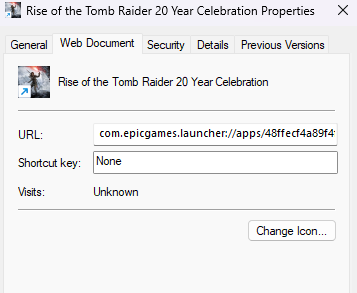
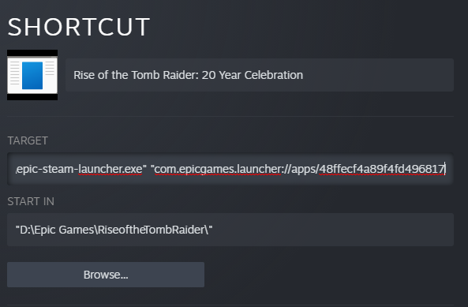
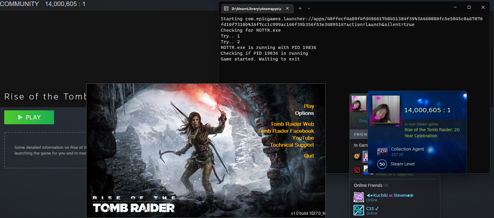

# Epic Steam Launcher

**SHA-256:** EB399AE35F04191392DA13F3A4D93C765EC045BC866C9F1BF5A91BFDB30A3115

## Description

Launch your EGS games while using Steam.

## Running the app

- Get Game Url via shortcut (Create Desktop Shortcut if you haven't)
- Add a Non-Steam Game
- Select the game executable file (.exe)
- Modify the Target with the value below

```
$ "epic-steam-launcher.exe" "com.epicgames.launcher://GAME_URL_HERE" "GAME_EXE_NAME_HERE.exe"
```




## Result

